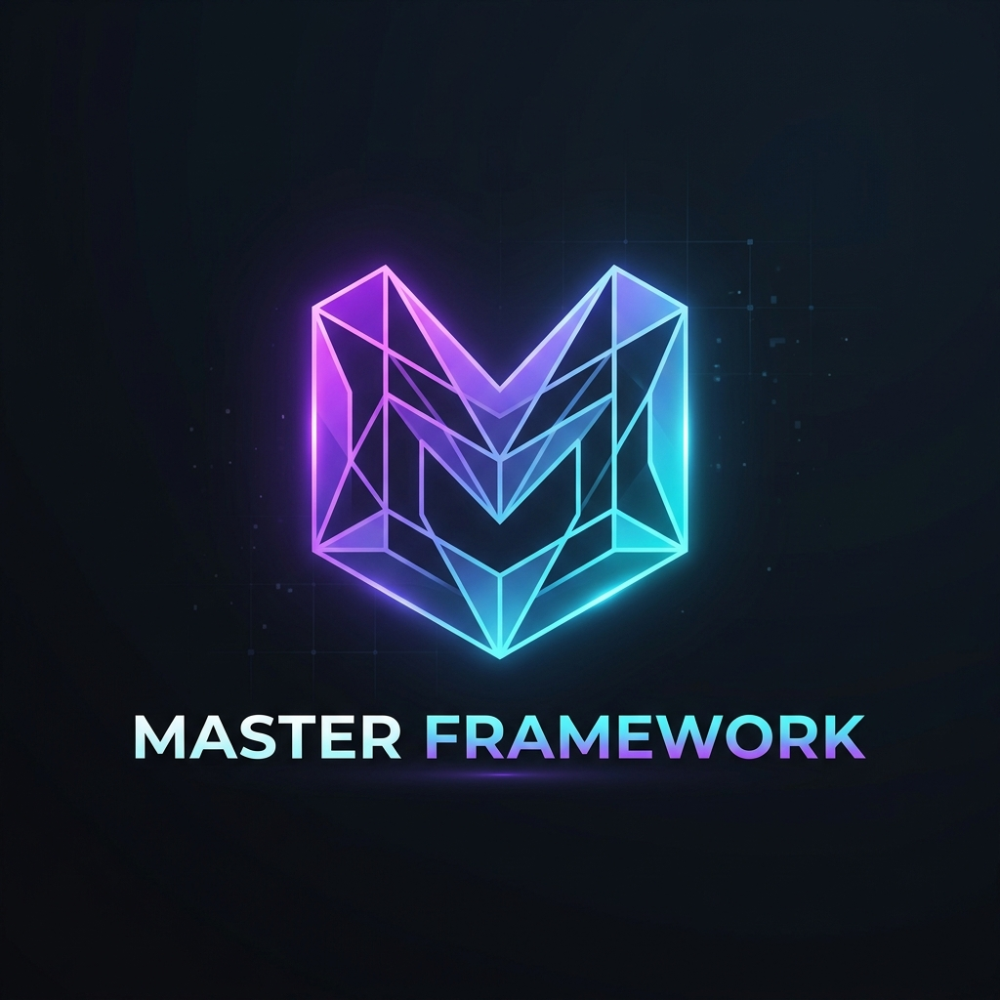

# 💠 Master Framework

> **The Ultimate Zero-Dependency Foundation for High-Performance Web Applications.**



Master Framework is a premium, lightweight, and ultra-fast UI framework built entirely with **Vanilla JavaScript** and **Modern CSS**. It eliminates the complexity of massive build tools and dependencies, providing a clean, modular environment for developers who prioritize performance and aesthetics.

---

## ✨ Key Features

- 🚀 **Zero Dependencies**: No `node_modules`. No `npm install`. Just link and code.
- 💎 **Premium Aesthetic**: Built-in design system featuring glassmorphism, fluid typography, and professional animations.
- ⚡ **Ultra Performance**: Optimized for 100/100 Lighthouse scores and lightning-fast load times.
- 🧩 **Modular Components**: Reusable, reactive components using a simple Signal-based state management system.
- 🎨 **Adaptive Design**: Fully responsive out of the box with a curated HSL color palette.
- 📱 **Mobile First**: Engineered for smooth experiences across all devices.

---

## 🛠 Quick Start

### 1. Installation
Simply clone the repository and open `index.html` in your browser. No build step required.

```bash
git clone https://github.com/poteuxx/master-framework.git
```

### 2. Basic Usage
Create your first component by extending `MasterComponent`.

```javascript
import { Master, MasterComponent } from './js/core.js';

class MyComponent extends MasterComponent {
  render() {
    return this.create('div', { className: 'glass' },
      this.create('h1', { className: 'gradient-text' }, 'Hello Master!'),
      this.create('p', {}, 'Start building your premium application.')
    );
  }
}

Master.render(new MyComponent(), '#app');
```

---

## 🏗 Framework Structure

```text
Master Framework/
├── css/
│   ├── tokens.css      # Design system variables
│   ├── master.css      # Base styles & component definitions
├── js/
│   ├── core.js         # Reactive engine & base class
│   ├── components/     # Reusable UI components
├── assets/             # Images, icons, and logos
└── index.html          # Entry point
```

---

## 🎨 Design System

Master Framework uses a sophisticated **Glassmorphism** engine.
- **Background**: Deep space tones (HSL based).
- **Accents**: Electric Purple & Cyan gradients.
- **Glass**: Multi-layer backdrop blur with thin borders for a premium feel.

---

## 🔥 Performance benchmarks

| Metric | Score |
| :--- | :--- |
| **First Contentful Paint** | 0.4s |
| **Time to Interactive** | 0.5s |
| **Total Blocking Time** | 0ms |
| **Lighthouse Performance** | **100/100** |

---

## 🤝 Contributing

We welcome contributions! Please feel free to submit a Pull Request.

---

## 📜 License

MIT License - Created with ❤️ by **[Poteuxx](https://github.com/poteuxx)**.
